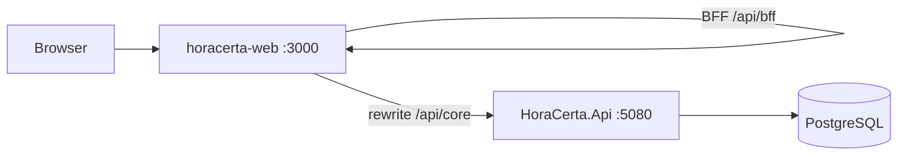

# HoraCerta

Sistema de agendamento para estabelecimentos — API .NET 8 + portal Next.js.

## Arquitetura



| Componente | Pasta | Documentação |
|------------|-------|----------------|
| API | `src/HoraCerta.Api` | [docs/backend/spec.md](docs/backend/spec.md) |
| Portal | `src/horacerta-web` | [docs/frontend/spec.md](docs/frontend/spec.md) |
| Domínio | `docs/docs.md`, `docs/agregados.md` | |

## Início rápido (Docker)

```bash
cp .env.example .env
docker compose up --build
```

| URL | Descrição |
|-----|-----------|
| http://localhost:3000 | Portal |
| http://localhost:5080/swagger | API (ambiente Docker) |

## Desenvolvimento local

**API**

```bash
cd src/HoraCerta.Api
dotnet run
```

**Portal**

```bash
cd src/horacerta-web
cp .env.local.example .env.local
npm install
npm run dev
```

## Testes

```bash
cd src && dotnet test src.sln
cd src/horacerta-web && npm run test
cd src/horacerta-web && npm run test:e2e   # requer portal rodando
```

Checklist manual: [docs/smoke-test.md](docs/smoke-test.md).

## Skills Cursor

- [horacerta-backend](.cursor/skills/horacerta-backend/SKILL.md)
- [horacerta-frontend](.cursor/skills/horacerta-frontend/SKILL.md)
- [horacerta-frontend-auth](.cursor/skills/horacerta-frontend-auth/SKILL.md)
