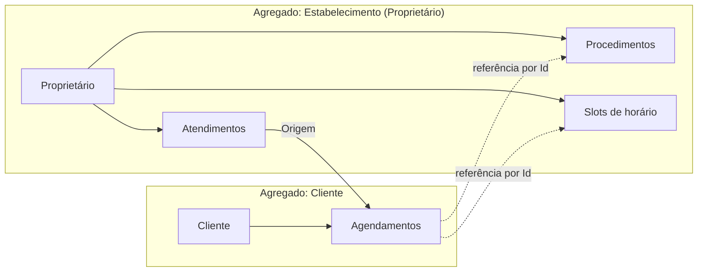

# Limites de agregado — HoraCerta

Este documento define **agregados**, **regras de consistência** e **fronteiras transacionais** do domínio, alinhados a `docs.md` e ao código em `HoraCerta.Dominio`.

---

## Visão geral



| Agregado | Raiz | Persistência sugerida |
|----------|------|------------------------|
| **Estabelecimento** | `ProprietarioEntidade` | 1 documento/linha por negócio (proprietário + catálogo + calendário + atendimentos) |
| **Cliente** | `ClienteEntidade` | 1 documento/linha por cliente (dados + histórico de agendamentos) |

> **Agenda:** o conceito permanece na linguagem ubíqua, mas **não é mais uma entidade separada**. Horários e atendimentos ficam em `ProprietarioEntidade.Horarios` e `ProprietarioEntidade.Atendimentos`; `IGerenciadorAgenda` opera sobre a raiz do estabelecimento.

---

## 1. Agregado Estabelecimento (`ProprietarioEntidade`)

**Responsabilidade:** tudo que o dono do negócio controla — catálogo, calendário e execução dos serviços.

### Composição

| Tipo | Conceito | Classe atual | Observação |
|------|----------|--------------|------------|
| Raiz | Proprietário | `ProprietarioEntidade` | Tenant do sistema |
| Entidade filha | Procedimento | `ProcedimentoEntidade` | Catálogo de serviços |
| Entidade filha | Slot de horário | `SlotHorarioEntidade` | Disponibilidade e ocupação temporal |
| Entidade filha | Atendimento | `AtendimentoEntidade` | Fulfillment pós-agendamento |
| Serviço de domínio | Gestão de procedimentos | `IGerenciadorProcedimentos` | Orquestra CRUD do catálogo |
| Serviço de domínio | Gestão de agenda/calendário | `IGerenciadorAgenda` | Slots, conflitos, criação de atendimento |

### Invariantes (sempre verdadeiras dentro do agregado)

1. Dois slots **disponíveis** não podem ter o mesmo `Inicio` (já validado em `GerenciadorAgenda.CriarHorarioDisponivel`).
2. Um slot **não disponível** não pode ter duração alterada (`SlotHorarioEntidade.AlterarDuracao`).
3. `ConflitaCom` define sobreposição entre intervalos `[Inicio, Fim]`.
4. Atendimento só nasce de agendamento **confirmado** (`CriarAtendimento`).
5. Procedimento inativo não deve ser oferecido em novos agendamentos (regra de aplicação ao consultar catálogo).

### O que pode mudar numa única transação

- Cadastrar/alterar/inativar procedimentos (UC 9).
- Criar/remover slots disponíveis (UC 10).
- Registrar atendimento e alterar estado do atendimento (épico 5).
- Resolver conflito de horário ao criar atendimento (`ValidarConflitosDeHorario`).

### O que **não** deve mudar só dentro deste agregado

- Criar ou confirmar **agendamento** do cliente (pertence ao agregado Cliente, mas **reserva** slot aqui — ver operações entre agregados).

---

## 2. Agregado Cliente (`ClienteEntidade`)

**Responsabilidade:** identidade do cliente e o ciclo de vida dos **agendamentos** (intenção de reserva).

### Composição

| Tipo | Conceito | Classe atual |
|------|----------|--------------|
| Raiz | Cliente | `ClienteEntidade` |
| Entidade filha | Agendamento | `AgendamentoEntidade` |
| Serviço de domínio | Gestão de agendamentos | `IGerenciadorAgendamentos` |

### Invariantes

1. Agendamento nasce **Pendente** e reserva slot (`StatusSlotAgendamento.RESERVADO`).
2. Transições de estado seguem a máquina em `IEstadoAgendamento` (Pendente → Confirmado | Cancelado; Confirmado → Cancelado | Finalizado | Remarcado; etc.).
3. Procedimento só pode ser trocado enquanto **Pendente**.
4. Remarcação gera **novo** agendamento pendente ligado ao anterior (`Reagendamento`).
5. Agendamento **finalizado** ou **remarcado** (como estado terminal da instância antiga) não altera slot nem procedimento.

### O que pode mudar numa única transação

- Iniciar agendamento (UC 1–3).
- Confirmar / cancelar / remarcar (UC 4–6).
- Encadear histórico de remarcações na coleção do cliente.

---

## 3. Por que `Agendamento` e `Atendimento` são conceitos separados

| | Agendamento | Atendimento |
|---|-------------|-------------|
| **Fase** | Negociação / reserva (cliente) | Execução (estabelecimento) |
| **Ator principal** | Cliente + WhatsApp | Proprietário |
| **Estados** | Pendente, Confirmado, Cancelado, Remarcado, Finalizado | Pendente, Realizado, Cancelado, Falha |
| **Slot** | Reserva e libera | Herda slot já confirmado do agendamento origem |
| **Agregado** | Cliente | Estabelecimento |

Unificar em uma única entidade misturaria duas máquinas de estado e dois contextos de responsabilidade. A separação está correta.

---

## 4. Operações entre agregados (sem transação distribuída única)

Estes fluxos tocam **dois agregados**. Na aplicação, orquestre em sequência com **consistência eventual** ou transação de aplicação que persista ambos (mesmo DB, duas raízes).

### 4.1 Iniciar agendamento (UC 1–3)

```mermaid
sequenceDiagram
    participant App as Camada Aplicação
    participant Cli as Agregado Cliente
    participant Est as Agregado Estabelecimento

    App->>Est: Buscar procedimento + slots DISPONÍVEIS
    Est-->>App: Procedimento, Slot
    App->>Cli: IniciarAgendamento(procedimento, slot)
    Cli->>Cli: Agendamento PENDENTE + reserva slot (em memória)
    Note over Cli,Est: Slot é referência ao objeto do Estabelecimento hoje;<br/>na persistência use ProprietarioId + SlotId
    App->>Est: Persistir slot RESERVADO
    App->>Cli: Persistir agendamento
```

**Regra:** se falhar após reservar slot, liberar slot (compensação).

### 4.2 Confirmar agendamento (UC 4)

1. `Cliente`: `ConfirmarAgendamento` → estado **Confirmado**.
2. `Estabelecimento`: slot permanece **Reservado** (até virar atendimento ou cancelar).
3. Disparar evento/mensagem WhatsApp (infraestrutura).

O passo 3 do UC (“registrar na agenda”) no modelo atual **não** duplica agendamento na agenda do proprietário — a ocupação já está no **slot**. A agenda do dono consulta slots por status.

### 4.3 Cancelar / remarcar (UC 5–6)

| Passo | Cliente | Estabelecimento |
|-------|--------|-----------------|
| Cancelar | `CancelarAgendamento` → libera slot no objeto agendamento | Atualizar slot → DISPONÍVEL |
| Remarcar | Antigo → REMARCADO; novo PENDENTE na coleção | Liberar slot antigo; reservar novo |

### 4.4 Criar atendimento (épico 5 — pós-confirmação)

```mermaid
sequenceDiagram
    participant App as Camada Aplicação
    participant Cli as Agregado Cliente
    participant Est as Agregado Estabelecimento

    App->>Cli: Buscar agendamento CONFIRMADO
    App->>Est: CriarAtendimento(agendamento)
    Est->>Est: Validar conflitos; FINALIZAR agendamento; slot CONFIRMADO; novo Atendimento
    App->>Cli: Persistir agendamento finalizado
    App->>Est: Persistir atendimento + slots
```

**Importante:** `GerenciadorAgenda.CriarAtendimento` hoje altera o **mesmo objeto** `AgendamentoEntidade` passado por referência. Na persistência, isso exige atualizar **ambos** os agregados na mesma unidade de trabalho da aplicação.

### 4.5 Consultas somente leitura (sem transação de escrita)

- Listar procedimentos para o bot → agregado Estabelecimento.
- Horários disponíveis → slots `DISPONIVEL` do Estabelecimento.
- Histórico do cliente → agregado Cliente.

---

## 5. Mapeamento casos de uso → agregados

| UC | Nome | Escrita em Estabelecimento | Escrita em Cliente | Outros |
|----|------|---------------------------|-------------------|--------|
| 1–3 | Iniciar / escolher / horários | Slot (reserva) | Agendamento | — |
| 4 | Confirmar | — (slot já reservado) | Agendamento | WhatsApp |
| 5 | Cancelar | Slot (libera) | Agendamento | WhatsApp |
| 6 | Remarcar | Slots antigo/novo | 2 agendamentos | WhatsApp |
| 7 | Lembrete | — | — | Infra (leitura Cliente + Slot) |
| 8 | Avaliar | — (futuro) | — (futuro) | Novo agregado ou entidade Avaliacao |
| 9 | Procedimentos | Procedimento | — | — |
| 10 | Agenda | Slot | — | — |
| 11 | Fluxos comunicação | — | — | Futuro: agregado ConfiguracaoComunicacao |

---

## 6. Papéis dos gerenciadores, repositórios e eventos

### Gerenciadores (serviços de domínio)

| Interface | Agregado que serve | Responsabilidade |
|-----------|-------------------|------------------|
| `IGerenciadorProcedimentos` | Estabelecimento | Catálogo |
| `IGerenciadorAgenda` | Estabelecimento | Calendário, conflitos, atendimentos |
| `IGerenciadorAgendamentos` | Cliente | Ciclo de vida do agendamento |

Os gerenciadores registram **eventos de domínio** na raiz (`AdicionarEventoDominio`) após cada transição relevante.

### Repositórios

| Contrato | Camada |
|----------|--------|
| `IRepositorio<T>`, `IProprietarioRepositorio`, `IClienteRepositorio` | **Domínio** (`where T : IAggregateRoot`) |
| `InMemory*Repositorio` (provisório) | **Infraestrutura** |
| Handlers consomem interfaces do domínio | **Aplicação** |

### Eventos de domínio

- Contrato base: `IDomainEvent` em `_Shared/Interfaces`
- Records junto a quem dispara: `Cliente/Eventos/` (agendamento), `Proprietario/Eventos/` (slot, atendimento)
- Coleta: `AggregateRootBase` expõe `EventosDominio`
- Despacho: `IDomainEventDispatcher` na **Aplicação**, após `Salvar` via `UnidadeTrabalhoDominio`

---

## 7. Identificadores entre agregados

Na persistência, referências cruzadas devem ser por **Id**, não por referência de objeto em memória:

```
AgendamentoEntidade
  - ProprietarioId
  - ProcedimentoId
  - SlotHorarioId (opcional após cancelar)
  - ClienteId (implícito pela raiz)

AtendimentoEntidade
  - AgendamentoOrigemId
  - ProprietarioId
```

Value objects úteis (futuro): `Telefone`, `IntervaloHorario` (se slot deixar de ser entidade com Id — hoje mantém-se entidade filha).

---

## 8. Camada de aplicação (implementado)

Handlers em `HoraCerta.Aplicacao` orquestram os dois agregados e persistem via `IProprietarioRepositorio` / `IClienteRepositorio` (implementações in-memory para testes):

| Caso de uso | Handler | Agregados |
|-------------|---------|-----------|
| Iniciar agendamento | `IniciarAgendamentoHandler` | Cliente + Estabelecimento |
| Confirmar agendamento | `ConfirmarAgendamentoHandler` | Cliente |
| Cancelar agendamento | `CancelarAgendamentoHandler` | Cliente + Estabelecimento |
| Remarcar agendamento | `RemarcarAgendamentoHandler` | Cliente + Estabelecimento |
| Abrir horário | `CriarSlotDisponivelHandler` | Estabelecimento |
| Registrar atendimento | `RegistrarAtendimentoHandler` | Cliente + Estabelecimento |

---

## 9. Resumo executivo

| Pergunta | Resposta |
|----------|----------|
| Quantos agregados? | **2** (Estabelecimento, Cliente) + entidades filhas |
| `Agenda` é agregado? | **Não** — coleções `Horarios` e `Atendimentos` no `ProprietarioEntidade` |
| `Agendamento` + `Atendimento`? | **Manter separados** — fases diferentes |
| Gerenciadores estão no lugar certo? | **Sim**, como serviços de domínio; evoluir injeção |
| UC 4 “registra na agenda” | Significa **ocupar slot**, não copiar agendamento para a agenda do dono |

Este mapa deve guiar repositórios, handlers na `HoraCerta.Aplicacao` e desenho de API sem violar consistência entre proprietário e cliente.
