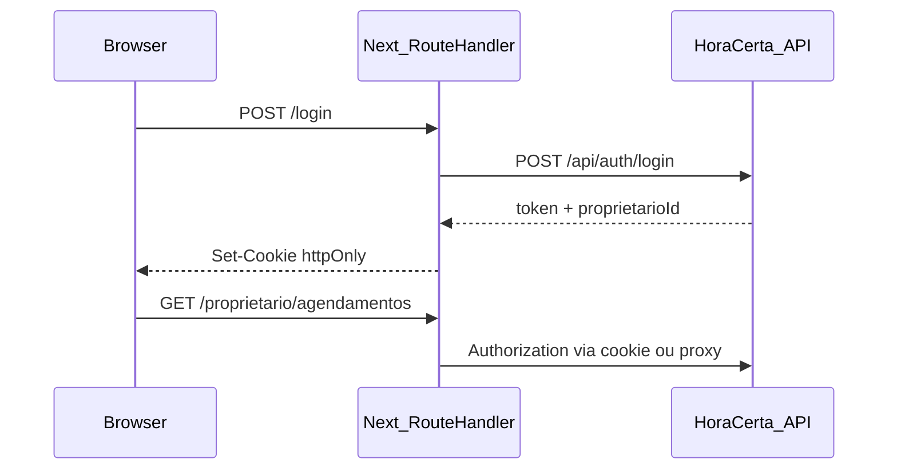

# Spec: Portal Web HoraCerta

Versão: 1.0 (MVP)  
Backend de referência: `src/HoraCerta.Api`  
Documentação de domínio: [`docs/docs.md`](../docs.md), [`docs/agregados.md`](../agregados.md)

---

## 1. Visão

Portal único em **Next.js + React + TypeScript** onde **Proprietário** e **Cliente** executam os fluxos dos casos de uso documentados, **sem WhatsApp** nesta entrega.

| Ator | Área do portal | Autenticação |
|------|----------------|--------------|
| Proprietário | `/proprietario/*` | JWT em **cookie httpOnly** |
| Cliente | `/e/[proprietarioId]/*` | Sessão em **cookie** (`clienteId`, contexto do estabelecimento) |

---

## 2. Decisões de produto (fechadas)

| # | Tópico | Decisão |
|---|--------|---------|
| 1 | Cancelar / remarcar | **Somente proprietário no MVP** — cliente não cancela nem remarca no portal |
| 2 | Sessão cliente | **Cookie** (não `localStorage`) |
| 3 | JWT proprietário | **Cookie httpOnly** — token inacessível a JavaScript |
| 4 | Contratos TypeScript | **Manuais** — alinhados a `HoraCerta.Api/Contratos`; sem OpenAPI |
| 5 | Lembrete (UC 7) | **Informativo** no portal; envio real permanece no backend (job/log) |

### Fluxo resumido MVP

**Cliente:** agendar (PENDENTE) → aguardar confirmação → (opcional) ver meus agendamentos → avaliar após REALIZADO.

**Proprietário:** login → procedimentos → slots → listar agendamentos → confirmar / cancelar / remarcar → registrar atendimento → alterar estado → ver avaliações.

---

## 3. Casos de uso × portal × API

### Cliente

| UC | Nome | Portal MVP | API |
|----|------|------------|-----|
| 1–3 | Iniciar / escolher procedimento e horário | Wizard em `/e/[id]/agendar` | `GET .../procedimentos`, `GET .../slots/disponiveis`, `POST /api/clientes`, `POST /api/agendamentos/iniciar` |
| 4 | Confirmar | **Não** — proprietário confirma; cliente vê status pendente | `POST .../confirmar` (JWT) |
| 5–6 | Cancelar / remarcar | **Fora do MVP cliente** | JWT proprietário |
| 7 | Lembrete | Texto informativo na UI | Backend apenas |
| 8 | Avaliar | `/e/[id]/avaliar/[agendamentoId]` | `POST .../avaliar` |

Consulta adicional: `GET /api/clientes/{clienteId}/agendamentos`.

### Proprietário

| UC | Nome | Portal MVP | API |
|----|------|------------|-----|
| — | Auth | `/login`, `/registrar` | `POST /api/auth/login`, `POST /api/auth/registrar` |
| 9 | Procedimentos | `/proprietario/procedimentos` | `GET/POST .../procedimentos`, `POST .../inativar` |
| 10 | Agenda (slots) | `/proprietario/agenda` | `GET .../slots/disponiveis`, `POST .../slots` |
| 4–6 | Agendamentos | `/proprietario/agendamentos` | `GET .../agendamentos`, confirmar/cancelar/remarcar |
| — | Atendimento | Integrado em agendamentos ou `/proprietario/atendimentos` | `POST .../atendimento`, `PATCH .../atendimentos/{id}/estado` |
| 8 | Avaliações | Detalhe na lista de agendamentos | `GET .../agendamentos/{id}/avaliacao` |
| 11 | Fluxos comunicação | **Fora do MVP** | — |

---

## 4. Requisitos não funcionais

- Idioma: **PT-BR**
- UI: **Ant Design**; mobile-first no fluxo cliente
- Performance: loading/skeleton em listagens; erros com `message` / `notification` (Ant Design)
- Acessibilidade: labels em formulários; preferir componentes Ant Design acessíveis
- **Proibido:** TanStack Query / React Query
- **Estado global:** Zustand (slices por bounded context)
- **HTTP:** Axios apenas na camada `infrastructure/api`

---

## 5. Arquitetura (DDD + Clean Architecture)

### 5.1 Camadas por entidade

Cada bounded context segue a pasta da entidade com **tudo que lhe pertence**:

```
[nome-entidade]/
├── domain/
│   ├── entities/
│   ├── value-objects/
│   └── repositories/          # interfaces (I*Repository)
├── application/
│   ├── use-cases/
│   └── dtos/
├── infrastructure/
│   └── api/
│       ├── [entidade].api.ts           # funções Axios (recebem AxiosInstance)
│       └── [entidade].repository.ts    # implementa interface do domain
└── presentation/
    ├── components/
    ├── hooks/
    ├── stores/                 # Zustand deste contexto (se aplicável)
    └── mappers/                # DTO API → domain
```

### 5.2 Regras de dependência

| Camada | Pode importar |
|--------|----------------|
| `presentation` | `application`, `domain` (tipos), stores locais |
| `application` | `domain` |
| `infrastructure` | `domain`, `shared/infrastructure/http` |
| `domain` | nada de React, Axios, Zustand, Ant Design |

- **Proibido:** Axios ou URLs em `presentation/components`
- **Proibido:** lógica de negócio em componentes — usar use cases

### 5.3 Estrutura raiz do projeto front

```
src/
├── app/                        # Next.js App Router (rotas, layouts, Route Handlers)
├── shared/
│   ├── domain/
│   ├── application/
│   └── infrastructure/
│       └── http/
│           ├── axios-client.ts
│           └── api-error.ts
├── auth/
├── proprietario/
├── cliente/
├── procedimento/
├── slot-horario/
├── agendamento/
├── atendimento/
└── avaliacao/
```

### 5.4 HTTP desacoplado

- `shared/infrastructure/http/axios-client.ts` — factory `createAxiosInstance({ baseURL, withCredentials })`
- Repositórios recebem `AxiosInstance` por injeção ou factory
- Use cases dependem de `I*Repository`, nunca de Axios
- Contratos request/response: arquivos manuais em `application/dtos` ou `infrastructure/api/types.ts` por entidade, espelhando `HoraCerta.Api/Contratos`

### 5.5 Estado (Zustand)

| Store | Responsabilidade |
|-------|----------------|
| `auth/presentation/stores/auth.store.ts` | `proprietarioId`, `isAuthenticated` (derivado de sessão/cookie, **sem** guardar JWT) |
| `cliente/presentation/stores/cliente-sessao.store.ts` | `clienteId`, `proprietarioId` do fluxo público |

- Atualizar store após use cases bem-sucedidos
- Estado de tela (loading, modal aberto): `useState` nos hooks de presentation
- Após mutação: **refetch explícito** via use case (sem cache automático TanStack)

---

## 6. Autenticação e cookies

### Proprietário (JWT httpOnly)



- Middleware Next protege `/proprietario/*`
- Axios: `withCredentials: true` quando chamar API diretamente; preferir **Route Handlers** BFF para setar/ler cookies httpOnly
- Zustand reflete sessão após login (ex.: `proprietarioId` vindo da resposta ou endpoint `/api/me`)

### Cliente (cookie de sessão)

- Após `POST /api/clientes` + iniciar agendamento: persistir `clienteId` e `proprietarioId` em cookie
- Cookie pode ser legível pelo app ou via Route Handler — **não** usar `localStorage`
- Rotas `/e/[proprietarioId]/meus-agendamentos` exigem cookie válido

---

## 7. Rotas (Next.js App Router)

| Rota | Auth | Descrição |
|------|------|-----------|
| `/` | Pública | Landing ou redirect |
| `/login` | Pública | Login proprietário |
| `/registrar` | Pública | Registro estabelecimento + credenciais |
| `/proprietario` | JWT cookie | Layout painel |
| `/proprietario/procedimentos` | JWT | UC 9 |
| `/proprietario/agenda` | JWT | Slots (UC 10) |
| `/proprietario/agendamentos` | JWT | Listagem + confirmar/cancelar/remarcar |
| `/proprietario/atendimentos` | JWT | Opcional: gestão de atendimentos |
| `/e/[proprietarioId]` | Pública | Home do estabelecimento |
| `/e/[proprietarioId]/agendar` | Pública | Wizard agendamento |
| `/e/[proprietarioId]/meus-agendamentos` | Cookie cliente | Lista agendamentos |
| `/e/[proprietarioId]/avaliar/[agendamentoId]` | Pública | UC 8 |

---

## 8. Mapa entidade ↔ API

| Módulo front | Endpoints |
|--------------|-----------|
| `auth` | `/api/auth/login`, `/api/auth/registrar` |
| `proprietario` | `/api/proprietarios`, `/api/proprietarios/{id}` |
| `cliente` | `/api/clientes`, `/api/clientes/{id}`, `/api/clientes/{id}/agendamentos` |
| `procedimento` | `/api/proprietarios/{id}/procedimentos` |
| `slot-horario` | `/api/proprietarios/{id}/slots`, `.../disponiveis` |
| `agendamento` | `/api/agendamentos/*` |
| `atendimento` | `.../atendimento`, `PATCH .../atendimentos/{id}/estado` |
| `avaliacao` | `POST .../avaliar`, `GET .../avaliacao` |

Referência de contratos C#: `src/HoraCerta.Api/Contratos/Requisicoes.cs`, `*Resposta.cs`.

---

## 9. Stack técnica

| Item | Escolha |
|------|---------|
| Framework | Next.js (App Router) |
| UI | React + TypeScript `strict` |
| Componentes | Ant Design (`antd`) |
| HTTP | Axios (somente `infrastructure/api`) |
| Estado global | Zustand |
| Cache servidor | **Não** — sem TanStack Query |
| Contratos API | TypeScript manual |
| Testes | Vitest + Testing Library; Playwright (fase 2) |

---

## 10. Critérios de aceite (MVP)

- [ ] Proprietário: registrar, login (cookie httpOnly), CRUD procedimentos, criar slots
- [ ] Proprietário: listar agendamentos, confirmar pendentes, cancelar, remarcar
- [ ] Proprietário: registrar atendimento, marcar REALIZADO / CANCELADO / FALHA
- [ ] Proprietário: visualizar avaliação de um agendamento
- [ ] Cliente: fluxo agendar completo (PENDENTE + mensagem de espera)
- [ ] Cliente: meus agendamentos via cookie de sessão
- [ ] Cliente: avaliar após REALIZADO
- [ ] Cliente: **sem** cancelar/remarcar na UI
- [ ] Lembrete: copy informativo apenas
- [ ] Nenhum componente importa Axios
- [ ] Pastas seguem `[entidade]/{domain,application,infrastructure,presentation}`
- [ ] Sem dependência `@tanstack/react-query`

---

## 11. Fora de escopo (MVP)

- WhatsApp / UC 11 (fluxos de comunicação)
- Cancelar/remarcar pelo cliente
- OpenAPI / geração automática de client
- TanStack Query
- Notificações push de lembrete

---

## 12. Evolução planejada (pós-MVP)

- API ou token para cliente cancelar/remarcar
- OpenAPI opcional
- Área de configuração de mensagens (UC 11)
- CORS/BFF consolidado se front e API em domínios diferentes em produção
