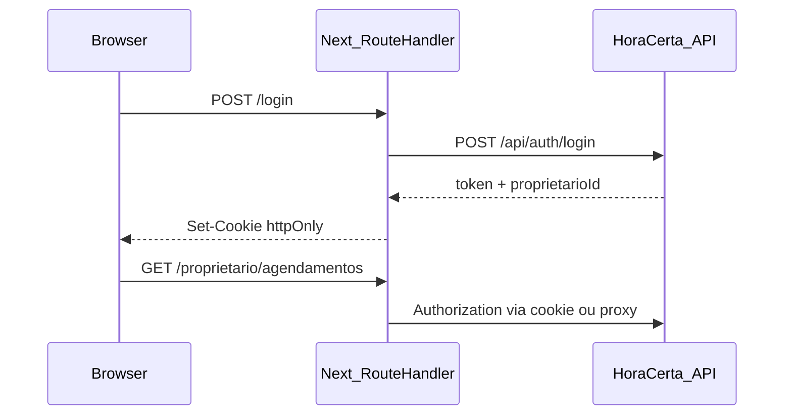

# Spec: Portal Web HoraCerta

Versão: 1.0 (MVP)  
Backend de referência: `src/HoraCerta.Api`  
Documentação de domínio: [`docs/docs.md`](../docs.md), [`docs/agregados.md`](../agregados.md)  
Fluxo de desenvolvimento: [`docs/workflow/spec.md`](../workflow/spec.md)

---

## 1. Visão

Portal único em **Next.js + React + TypeScript** onde **Proprietário** e **Cliente** executam os fluxos dos casos de uso documentados, **sem WhatsApp** nesta entrega.

| Ator | Área do portal | Autenticação |
|------|----------------|--------------|
| Proprietário | `/proprietario/*` | JWT em **cookie httpOnly** |
| Cliente | `/e/[proprietarioId]/*` | Sessão em **cookie** (`clienteId`, contexto do estabelecimento) |

---

## 2. Decisões de produto (fechadas)

| # | Tópico | Decisão |
|---|--------|---------|
| 1 | Cancelar / remarcar | **Somente proprietário no MVP** — cliente não cancela nem remarca no portal |
| 2 | Sessão cliente | **Cookie** (não `localStorage`) |
| 3 | JWT proprietário | **Cookie httpOnly** — token inacessível a JavaScript |
| 4 | Contratos TypeScript | **Manuais** — alinhados a `HoraCerta.Api/Contratos`; sem OpenAPI |
| 5 | Lembrete (UC 7) | **Informativo** no portal; envio real permanece no backend (job/log) |

### Fluxo resumido MVP

**Cliente:** agendar (PENDENTE) → aguardar confirmação → (opcional) ver meus agendamentos → avaliar após REALIZADO.

**Proprietário:** login → procedimentos → slots → listar agendamentos → confirmar / cancelar / remarcar → registrar atendimento → alterar estado → ver avaliações.

---

## 3. Casos de uso × portal × API

### Cliente

| UC | Nome | Portal MVP | API |
|----|------|------------|-----|
| 1–3 | Iniciar / escolher procedimento e horário | Wizard 4 passos (`BookingWizard`: identificação com reutilização de sessão por estabelecimento → serviço → `WeekTimeGrid` → revisão) | `GET .../procedimentos`, `GET .../slots/disponiveis`, `POST /api/clientes`, `POST /api/agendamentos/iniciar` |
| 4 | Confirmar | **Não** — proprietário confirma; cliente vê status pendente | `POST .../confirmar` (JWT) |
| 5–6 | Cancelar / remarcar | **Fora do MVP cliente** | JWT proprietário |
| 7 | Lembrete | Texto informativo na UI | Backend apenas |
| 8 | Avaliar | `/e/[id]/avaliar/[agendamentoId]` | `POST .../avaliar` |

Consulta adicional: `GET /api/clientes/{clienteId}/agendamentos?proprietarioId=` → filtra por estabelecimento (slots do proprietário).

### Proprietário

| UC | Nome | Portal MVP | API |
|----|------|------------|-----|
| — | Auth | `/login`, `/registrar` | `POST /api/auth/login`, `POST /api/auth/registrar` |
| 9 | Procedimentos | `/proprietario/procedimentos` | `GET/POST .../procedimentos`, `POST .../inativar` |
| 10 | Agenda (slots) | `/proprietario/agenda` — visão **Semana** estilo calendário/Gantt (`WeekTimeGrid`: horários livres + agendamentos por cor/altura); **Lista** / **Tabela**; mobile: seletor de dia; preferência em `localStorage` | `GET .../slots/disponiveis`, `GET .../agendamentos`, `POST .../slots` |
| 4–6 | Agendamentos | `/proprietario/agendamentos` | `GET .../agendamentos`, confirmar/cancelar/remarcar |
| — | Atendimento | Integrado em agendamentos ou `/proprietario/atendimentos` | `POST .../atendimento`, `PATCH .../atendimentos/{id}/estado` |
| 8 | Avaliações | Detalhe na lista de agendamentos | `GET .../agendamentos/{id}/avaliacao` |
| 11 | Fluxos comunicação | **Fora do MVP** | — |

---

## 4. Requisitos não funcionais

- Idioma: **PT-BR**
- UI: **Ant Design**; mobile-first no fluxo cliente
- Performance: loading/skeleton em listagens; erros com `message` / `notification` (Ant Design)
- Acessibilidade: labels em formulários; preferir componentes Ant Design acessíveis
- **Proibido:** TanStack Query / React Query
- **Estado global:** Zustand (slices por bounded context)
- **HTTP:** Axios apenas na camada `infrastructure/api`

### 4.1 Design system e tema (UI/UX)

Identidade visual **HoraCerta**: minimalista, profissional, cantos arredondados, tipografia **Inter**, foco em fluxo de agendamento mobile.

| Token | Claro | Escuro |
|-------|-------|--------|
| Primária (ações) | `#10B981` (emerald) | `#10B981` / destaque `#34D399` |
| Fundo | `#F8FAFC` | `#0F172A` (navy) |
| Superfície (cards) | `#FFFFFF` | `#111827` |
| Texto | `#0F172A` / muted `#64748B` | `#F8FAFC` / muted `#94A3B8` |

**Modo escuro:** alternância global via `ThemeToggle`; preferência em `localStorage` (`horacerta-theme`); atributo `data-theme` no `<html>`; script inline no layout evita flash na carga.

**Implementação (código):**

| Artefato | Caminho |
|----------|---------|
| Tokens | `src/shared/presentation/theme/tokens.ts` |
| Tema Ant Design | `src/shared/presentation/theme/antd-config.ts` |
| Provider | `src/shared/presentation/theme/theme-provider.tsx` |
| Store tema | `src/shared/presentation/stores/theme.store.ts` |
| Variáveis CSS | `src/app/globals.css` |
| Shell auth | `src/shared/presentation/layouts/auth-shell.tsx` |
| Shell cliente | `src/shared/presentation/layouts/cliente-shell.tsx` |
| Nav cliente | `src/shared/presentation/components/cliente-nav.tsx` |
| Grade semanal (agenda/slots) | `src/shared/presentation/components/week-time-grid.tsx` |
| Agenda (lista por dia) | `src/shared/presentation/components/slot-calendar-grid.tsx` |
| Wizard agendamento | `src/cliente/presentation/components/booking-wizard.tsx` |
| Resumo checkout | `src/cliente/presentation/components/booking-summary.tsx` |
| Catálogo (cards home) | `src/catalogo/presentation/estabelecimento-card.tsx` |

**Padrões de UX:**

- **Home pública (`/`):** catálogo de estabelecimentos com busca; cards com CTA agendar.
- **Fluxo cliente:** `ClienteShell` com nav (Início / Agendar / Meus horários) e nome do estabelecimento; wizard em cards (`hc-card-elevated`); procedimentos como `hc-service-option`; horários na grade `.hc-week-slot` (selecionável); passo de revisão antes de confirmar.
- **Área proprietário:** sidebar escura com marca; conteúdo em cards; `PageHeader` em cada tela.
- **Agenda proprietário:** `Segmented` Semana / Lista / Tabela; semana com navegação anterior/próxima/Hoje e linha do horário atual.
- CTAs primários: `Button type="primary"` (cor emerald via tema).

Alterações visuais devem atualizar **este §4.1** e tokens, não hardcodar cores fora do tema salvo exceção documentada.

---

## 5. Arquitetura (DDD + Clean Architecture)

### 5.1 Camadas por entidade

Cada bounded context segue a pasta da entidade com **tudo que lhe pertence**:

```
[nome-entidade]/
├── domain/
│   ├── entities/
│   ├── value-objects/
│   └── repositories/          # interfaces (I*Repository)
├── application/
│   ├── use-cases/
│   └── dtos/
├── infrastructure/
│   └── api/
│       ├── [entidade].api.ts           # funções Axios (recebem AxiosInstance)
│       └── [entidade].repository.ts    # implementa interface do domain
└── presentation/
    ├── components/
    ├── hooks/
    ├── stores/                 # Zustand deste contexto (se aplicável)
    └── mappers/                # DTO API → domain
```

### 5.2 Regras de dependência

| Camada | Pode importar |
|--------|----------------|
| `presentation` | `application`, `domain` (tipos), stores locais |
| `application` | `domain` |
| `infrastructure` | `domain`, `shared/infrastructure/http` |
| `domain` | nada de React, Axios, Zustand, Ant Design |

- **Proibido:** Axios ou URLs em `presentation/components`
- **Proibido:** lógica de negócio em componentes — usar use cases

### 5.3 Estrutura raiz do projeto front

```
src/
├── app/                        # Next.js App Router (rotas, layouts, Route Handlers)
├── shared/
│   ├── domain/
│   ├── application/
│   └── infrastructure/
│       └── http/
│           ├── axios-client.ts
│           └── api-error.ts
├── auth/
├── proprietario/
├── cliente/
├── procedimento/
├── slot-horario/
├── agendamento/
├── atendimento/
├── avaliacao/
└── catalogo/                   # Catálogo público (home)
```

### 5.4 HTTP desacoplado

- `shared/infrastructure/http/axios-client.ts` — factory `createAxiosInstance({ baseURL, withCredentials })`
- Repositórios recebem `AxiosInstance` por injeção ou factory
- Use cases dependem de `I*Repository`, nunca de Axios
- Contratos request/response: arquivos manuais em `application/dtos` ou `infrastructure/api/types.ts` por entidade, espelhando `HoraCerta.Api/Contratos`

### 5.5 Estado (Zustand)

| Store | Responsabilidade |
|-------|----------------|
| `auth/presentation/stores/auth.store.ts` | `proprietarioId`, `isAuthenticated` (derivado de sessão/cookie, **sem** guardar JWT) |
| `cliente/presentation/stores/cliente-sessao.store.ts` | `clienteId`, `proprietarioId` do fluxo público |

- Atualizar store após use cases bem-sucedidos
- Estado de tela (loading, modal aberto): `useState` nos hooks de presentation
- Após mutação: **refetch explícito** via use case (sem cache automático TanStack)

---

## 6. Autenticação e cookies

### Proprietário (JWT httpOnly)



- Middleware Next protege `/proprietario/*`
- Axios: `withCredentials: true` quando chamar API diretamente; preferir **Route Handlers** BFF para setar/ler cookies httpOnly
- Zustand reflete sessão após login (ex.: `proprietarioId` vindo da resposta ou endpoint `/api/me`)

### Cliente (cookie de sessão)

- Após `POST /api/clientes` + iniciar agendamento: persistir `clienteId` e `proprietarioId` em cookie
- Cookie pode ser legível pelo app ou via Route Handler — **não** usar `localStorage`
- Rotas `/e/[proprietarioId]/meus-agendamentos` exigem cookie válido

---

## 7. Rotas (Next.js App Router)

| Rota | Auth | Descrição |
|------|------|-----------|
| `/` | Pública | Catálogo de estabelecimentos (busca + cards); atalho área do proprietário |
| `/login` | Pública | Login proprietário |
| `/registrar` | Pública | Registro estabelecimento + credenciais |
| `/proprietario` | JWT cookie | Layout painel |
| `/proprietario/procedimentos` | JWT | UC 9 |
| `/proprietario/agenda` | JWT | Slots (UC 10) |
| `/proprietario/agendamentos` | JWT | Listagem + confirmar/cancelar/remarcar |
| `/proprietario/atendimentos` | JWT | Opcional: gestão de atendimentos |
| `/e/[proprietarioId]` | Pública | Home do estabelecimento |
| `/e/[proprietarioId]/agendar` | Pública | Wizard agendamento (4 passos, layout wide) |
| `/e/[proprietarioId]/meus-agendamentos` | Cookie cliente | Lista agendamentos |
| `/e/[proprietarioId]/avaliar/[agendamentoId]` | Pública | UC 8 |

---

## 8. Mapa entidade ↔ API

| Módulo front | Endpoints |
|--------------|-----------|
| `auth` | `/api/auth/login`, `/api/auth/registrar` |
| `proprietario` | `/api/proprietarios`, `/api/proprietarios/{id}` |
| `cliente` | `/api/clientes`, `/api/clientes/{id}`, `/api/clientes/{id}/agendamentos` |
| `procedimento` | `/api/proprietarios/{id}/procedimentos` |
| `slot-horario` | `/api/proprietarios/{id}/slots`, `.../disponiveis` |
| `agendamento` | `/api/agendamentos/*` |
| `atendimento` | `.../atendimento`, `PATCH .../atendimentos/{id}/estado` |
| `avaliacao` | `POST .../avaliar`, `GET .../avaliacao` |
| `catalogo` | `GET /api/catalogo/estabelecimentos` |
| `cliente` (público) | `GET /api/proprietarios/{id}` (nome do estabelecimento no shell) |

Referência de contratos C#: `src/HoraCerta.Api/Contratos/Requisicoes.cs`, `*Resposta.cs`, `CatalogoRespostas.cs`.

---

## 9. Stack técnica

| Item | Escolha |
|------|---------|
| Framework | Next.js (App Router) |
| UI | React + TypeScript `strict` |
| Componentes | Ant Design (`antd`) |
| HTTP | Axios (somente `infrastructure/api`) |
| Estado global | Zustand |
| Cache servidor | **Não** — sem TanStack Query |
| Contratos API | TypeScript manual |
| Testes unitários | Vitest (funções puras, formatters, mappers) |
| Testes E2E | **BDD com Gherkin** + Playwright (`playwright-bdd`) |

---

## 9.1 Testes E2E — BDD (Gherkin)

Os fluxos do portal são especificados e executados em **BDD**: cenários legíveis para negócio, implementação automatizada com Playwright.

### Stack de testes

| Camada | Ferramenta | Escopo |
|--------|------------|--------|
| Unitário | Vitest | `shared/`, mappers, helpers |
| E2E (BDD) | Gherkin + `playwright-bdd` + Playwright | Fluxos completos no browser |

**Proibido** para E2E do portal: testes Playwright “crus” (`.spec.ts`) sem cenário Gherkin — novos fluxos entram como `.feature`.

### Estrutura de pastas

```
src/horacerta-web/
├── e2e/
│   ├── features/              # Cenários Gherkin (.feature)
│   │   ├── publico/           # Landing, login, registrar
│   │   ├── proprietario/      # Painel, procedimentos, agenda, agendamentos
│   │   └── cliente/           # Agendar, meus agendamentos, avaliar
│   ├── steps/                 # Step definitions (TypeScript)
│   │   ├── common.steps.ts
│   │   ├── auth.steps.ts
│   │   └── ...
│   └── .features-gen/       # Gerado por bddgen (não editar; gitignore)
├── playwright.config.ts
└── vitest.config.ts
```

### Convenções Gherkin

- Idioma dos cenários: **português** (`# language: pt` no topo de cada `.feature`).
- Palavras-chave: `Funcionalidade`, `Cenário`, `Dado`, `Quando`, `Então`, `E`.
- Um arquivo `.feature` por fluxo de negócio (ex.: `login-proprietario.feature`, `agendar-cliente.feature`).
- Cenários espelham os **critérios de aceite** (§10) e casos de uso da spec.
- **Tags** para filtrar execução:
  - `@mvp` — obrigatório no CI
  - `@proprietario`, `@cliente`, `@publico`
  - `@smoke` — subconjunto rápido

### Exemplo de cenário

```gherkin
# language: pt
@mvp @publico
Funcionalidade: Página inicial
  Para que eu acesse o portal
  Como visitante
  Quero ver o atalho para a área do proprietário

  @smoke
  Cenário: Exibir acesso à área do proprietário
    Dado que estou na página inicial
    Então devo ver o botão "Área do proprietário"
```

### Step definitions

- Ficam em `e2e/steps/**/*.ts`.
- Usam `createBdd()` de `playwright-bdd` (acesso a `page`, `context`, etc.).
- Steps **reutilizáveis** e parametrizados (`{string}`, `{int}`).
- **Proibido:** lógica de negócio ou chamadas Axios nos steps — apenas interação UI e asserções.

### Comandos

```bash
cd src/horacerta-web
npm run test:bdd          # bddgen + Playwright (todos @mvp)
npm run test:bdd:smoke    # apenas @smoke
npm run test              # Vitest (unitário)
```

Pré-requisito local: portal em `http://localhost:3000` (ou `PLAYWRIGHT_BASE_URL`). O `playwright.config.ts` sobe `npm run dev` automaticamente quando não estiver em CI.

### CI

- Job `frontend`: `npm run test` (Vitest) + build.
- Job `frontend-e2e` (ou etapa dedicada): `npx playwright install chromium` + `npm run test:bdd` com app em `npm run start` após build.

### Rastreabilidade

| Critério aceite (§10) | Feature BDD |
|----------------------|-------------|
| Login / registrar proprietário | `features/publico/login.feature`, `registrar.feature`, `login-autenticado.feature` |
| Landing / catálogo | `features/publico/landing.feature` |
| CRUD procedimentos, slots | `features/proprietario/procedimentos.feature`, `agenda.feature` |
| Agendamentos (confirmar, cancelar, remarcar, atendimento, avaliação) | `features/mvp/fluxo-completo.feature` (ciclo ponta a ponta) |
| Fluxo agendar cliente | `features/cliente/agendar.feature` |
| Meus agendamentos | `features/cliente/meus-agendamentos.feature` |

Checklist manual complementar: [`docs/smoke-test.md`](../smoke-test.md).

---

## 10. Critérios de aceite (MVP)

- [x] Proprietário: registrar, login (cookie httpOnly), CRUD procedimentos, criar slots
- [x] Proprietário: listar agendamentos, confirmar pendentes, cancelar, remarcar
- [x] Proprietário: registrar atendimento, marcar REALIZADO / CANCELADO / FALHA
- [x] Proprietário: visualizar avaliação de um agendamento
- [x] Proprietário: agenda com visão semanal (grade horária)
- [x] Cliente: fluxo agendar completo (PENDENTE + mensagem de espera + revisão)
- [x] Cliente: meus agendamentos via cookie de sessão
- [x] Cliente: avaliar após REALIZADO
- [x] Cliente: **sem** cancelar/remarcar na UI
- [x] Público: catálogo na home com estabelecimentos disponíveis
- [x] Lembrete: copy informativo apenas
- [x] Nenhum componente importa Axios (hooks de presentation consomem use cases)
- [x] Pastas seguem `[entidade]/{domain,application,infrastructure,presentation}`
- [x] Sem dependência `@tanstack/react-query`

---

## 11. Fora de escopo (MVP)

- WhatsApp / UC 11 (fluxos de comunicação)
- Cancelar/remarcar pelo cliente
- OpenAPI / geração automática de client
- TanStack Query
- Notificações push de lembrete

---

## 12. Evolução planejada (pós-MVP)

- API ou token para cliente cancelar/remarcar
- OpenAPI opcional
- Área de configuração de mensagens (UC 11)
- CORS/BFF consolidado se front e API em domínios diferentes em produção
