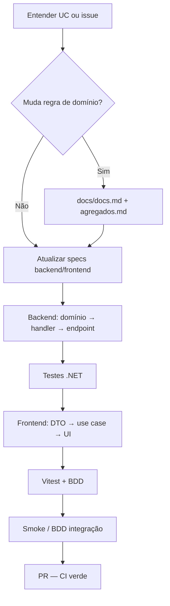

# Spec: Fluxo de desenvolvimento — HoraCerta

Versão: 1.0  
Escopo: novas features, correções e manutenção  
Domínio: [`docs/docs.md`](../docs.md), [`docs/agregados.md`](../agregados.md)  
API: [`docs/backend/spec.md`](../backend/spec.md)  
Portal: [`docs/frontend/spec.md`](../frontend/spec.md)  
Validação manual: [`docs/smoke-test.md`](../smoke-test.md)  
CI: [`.github/workflows/ci.yml`](../../.github/workflows/ci.yml)

---

## 1. Visão

Este documento define **como** desenvolver, testar e entregar mudanças no HoraCerta. As specs de backend e frontend descrevem **o que** está implementado; este fluxo une domínio, API, portal, testes e documentação.

| Documento | Responde |
|-----------|----------|
| `docs/docs.md` | Requisitos e casos de uso |
| `docs/backend/spec.md` / `docs/frontend/spec.md` | Arquitetura, rotas, decisões fechadas |
| **`docs/workflow/spec.md`** | Ordem de trabalho, DoD, PR, manutenção |
| `docs/smoke-test.md` | Checklist manual do MVP |

---

## 2. Tipos de trabalho

| Tipo | Exemplos | Atualizar specs? |
|------|----------|------------------|
| **Feature** | Novo UC, endpoint + tela | Sim — domínio (se regra nova), backend §6–8, frontend §3–8, critérios §10 |
| **Correção** | Bug auth, migration, UI | Só se mudar decisão arquitetural |
| **Manutenção** | Dependências, CI, Docker | Este doc + README + `.env.example` |
| **Refactor** | Sem mudança de comportamento | Testes verdes; spec só se estrutura mudar |
| **Cross-cutting** | Auth, cookies, BFF | Backend + frontend §6 + skill `horacerta-frontend-auth` |

**Regra:** comportamento novo ou decisão fechada → atualizar a spec afetada **no mesmo PR** (ou antes).

---

## 3. Fluxo geral (feature full-stack)



**Ordem padrão:** domínio → aplicação → API/contratos → testes backend → portal (módulo por entidade) → BDD se fluxo visível → documentação.

---

## 4. Checklist por camada

### 4.1 Backend

Ver também skill [horacerta-backend](../../.cursor/skills/horacerta-backend/SKILL.md).

1. Regra em `HoraCerta.Dominio` (se aplicável)
2. `Command` / `Query` + `Handler` em `HoraCerta.Aplicacao`
3. Registro em `HoraCerta.Api/Extensions/DependencyInjection.cs`
4. Endpoint em `Endpoints/` + records em `Contratos/`
5. Auth: `RequireAuthorization` + `ProprietarioAuthorizationFilter` em mutações do proprietário
6. Testes: unitário (domínio/handler); E2E para contrato HTTP relevante
7. Migration EF se schema mudar — **nunca** `EnsureCreated` para evolução
8. Validar **SQLite** (dev local) e **PostgreSQL** (Docker) se tocar persistência

### 4.2 Frontend

Ver skills [horacerta-frontend](../../.cursor/skills/horacerta-frontend/SKILL.md) e [horacerta-frontend-auth](../../.cursor/skills/horacerta-frontend-auth/SKILL.md).

1. Mapear endpoint e contrato em `HoraCerta.Api/Contratos` (camelCase na API)
2. `domain` → `application` (use case) → `infrastructure/api` (Axios) → `presentation`
3. Rota fina em `app/` — **sem** Axios em componentes
4. Após mutations: refetch explícito (sem TanStack Query)
5. JWT proprietário: BFF `/api/bff/*` + cookie httpOnly
6. Rotas públicas: rewrite `/api/core/*` → API
7. BDD: `.feature` em `e2e/features/` + steps; tag `@smoke` ou `@integracao`
8. `npm run lint`, `npm run test`, `npm run build`

---

## 5. Definition of Done (DoD)

Um item está **pronto** quando:

- [ ] Critérios da spec afetada cobertos ([backend §13](../backend/spec.md#13-critérios-de-aceite-api-mvp), [frontend §10](../frontend/spec.md#10-critérios-de-aceite-mvp))
- [ ] `cd src && dotnet test src.sln` — verde
- [ ] `cd src/horacerta-web && npm run lint && npm run test && npm run build` — verde
- [ ] Fluxo UI novo ou alterado: cenário BDD ou smoke manual atualizado
- [ ] Auth/cookies: validado em HTTP local **e** Docker (`NODE_ENV=production` no container web)
- [ ] Specs e skills atualizados se decisão mudou
- [ ] Sem segredos no commit (`.env` / `.env.local` gitignored)
- [ ] PR descreve o **porquê**, não só lista de arquivos

**Manutenção mínima:** build + testes da área tocada; smoke se alterar auth, compose ou migrations.

---

## 6. Ambientes de desenvolvimento

| Cenário | API | Portal | Banco |
|---------|-----|--------|-------|
| Dev local rápido | `dotnet run` → :5080 | `npm run dev` → :3000 | SQLite (`horacerta.db`) |
| Stack Docker | `docker compose` → :5080 | :3000 | PostgreSQL (volume) |
| BDD `@integracao` | `docker compose up -d postgres api` | `npm run dev` (outro terminal) | PostgreSQL |

### Variáveis

| Arquivo | Uso |
|---------|-----|
| `.env` (raiz) | Docker: Postgres, `JWT_KEY`, `API_URL=http://api:8080` |
| `.env.example` | Modelo versionado — copiar para `.env` |
| `src/horacerta-web/.env.local` | Dev local: `API_URL=http://localhost:5080` |

### Problemas frequentes

| Sintoma | Causa provável | Ação |
|---------|----------------|------|
| `relation "clientes" already exists` | Volume Postgres com schema sem `__EFMigrationsHistory` | `docker compose down -v` e subir de novo, ou baseline automático na API |
| `ENOTFOUND api` (web) | Container API parado | `docker compose ps`; aguardar healthcheck da API |
| 401 após login no Docker | Cookie `Secure` em HTTP | Cookie `secure` só em HTTPS (ver `cookies-options.ts`) |
| Login 400 | Credenciais inválidas | Registrar em `/registrar` ou conferir e-mail/senha |

---

## 7. Pirâmide de testes

| Nível | Local | Quando obrigatório |
|-------|-------|-------------------|
| Unitário .NET | `HoraCerta.Testes.Unitarios` | Regras de domínio, handlers |
| Integração .NET | `HoraCerta.Testes.Integracao` | Repositório, EF |
| E2E API | `HoraCerta.Testes.E2e` | Contrato HTTP, auth |
| Vitest | `**/*.test.ts` | Utilitários, formatação |
| BDD `@smoke` | `npm run test:bdd:smoke` | UI pública (sem API) |
| BDD `@integracao` | `npm run test:bdd:integracao` | Fluxos MVP (com API) |
| Smoke manual | `docs/smoke-test.md` | Release ou mudança ampla |

### CI (push/PR em `main` / `master`)

1. `backend` — restore, build, test  
2. `frontend` — lint, test, build  
3. `frontend-e2e-smoke` — Playwright `@smoke`  
4. `frontend-e2e-integracao` — compose `postgres` + `api`, BDD integração  
5. `docker` — `docker compose build`

Comandos locais equivalentes:

```bash
cd src && dotnet test src.sln
cd src/horacerta-web && npm run lint && npm run test && npm run build
cd src/horacerta-web && npm run test:bdd:smoke
# integração: docker compose up -d postgres api && npm run test:bdd:integracao
```

---

## 8. Contratos API ↔ portal (sem OpenAPI)

1. Alterar records em `HoraCerta.Api/Contratos/`
2. Atualizar [`docs/backend/spec.md`](../backend/spec.md) §6–7
3. Espelhar DTO em `horacerta-web/src/[entidade]/application/dtos/`
4. Atualizar [`docs/frontend/spec.md`](../frontend/spec.md) §8
5. BFF: `app/api/bff/` se JWT; rewrite `/api/core` se público

**Proibido no MVP:** codegen OpenAPI (decisão fechada nas specs de produto).

---

## 9. Migrations e banco

- Dev local: SQLite + `Database.Migrate()` na subida da API
- Docker: PostgreSQL + `Database:Provider=PostgreSQL` + `Migrate()`
- Nova migration: nome descritivo; revisar `Up`/`Down`; testar nos dois providers quando possível
- Não commitar `horacerta.db` com dados sensíveis
- Reset limpo do Postgres: `docker compose down -v`

---

## 10. Pull request

### Convenção de branch

| Prefixo | Uso |
|---------|-----|
| `feature/` | Nova funcionalidade |
| `fix/` | Correção de bug |
| `chore/` | Manutenção, deps, CI |
| `docs/` | Apenas documentação |

### Título

`tipo(escopo): descrição curta` — ex.: `feat(agendamento): listar cancelados pelo proprietário`

### Corpo sugerido

```markdown
## Contexto
[UC, issue ou bug]

## Mudanças
- Backend: ...
- Frontend: ...

## Testes
- [ ] dotnet test
- [ ] npm run lint / test / build
- [ ] BDD smoke ou integração (se UI)

## Documentação
- [ ] Specs atualizadas (se aplicável)
```

---

## 11. Manutenção recorrente

| Tarefa | Ação |
|--------|------|
| Atualizar pacote .NET / npm | PR isolado; CI completo |
| Atualizar imagem Docker | `docker compose up --build`; validar healthchecks |
| Débito técnico | Issue + entrada em § evolução das specs de produto |
| Regressão auth | `login-autenticado.feature` + smoke manual § proprietário |
| Novo desenvolvedor | README → este doc → spec da camada → skills Cursor |

---

## 12. Uso com Cursor / agentes

1. Ler **este documento** (`docs/workflow/spec.md`)
2. Ler spec da camada: [backend](../backend/spec.md) ou [frontend](../frontend/spec.md)
3. Aplicar skill: `horacerta-workflow`, `horacerta-backend`, `horacerta-frontend`
4. Auth, cookies, BFF → **`horacerta-frontend-auth`**
5. Não expandir escopo além do pedido; não refatorar arquivos não relacionados

---

## 13. Matriz — o que atualizar quando

| Mudou… | Atualizar |
|--------|-----------|
| Regra de negócio | `docs/docs.md`, `docs/agregados.md`, testes domínio |
| Endpoint / auth API | `docs/backend/spec.md`, `HoraCerta.Testes.E2e` |
| Tela / fluxo portal | `docs/frontend/spec.md`, `.feature` BDD |
| UI / tema / dark mode | `docs/frontend/spec.md` §4.1, `shared/presentation/theme/` |
| Cookie / BFF / sessão | frontend spec §6, skill auth |
| Docker / env / compose | README, backend spec §12, `.env.example` |
| Critério MVP | frontend §10, backend §13, `smoke-test.md` |
| Processo do time | **este documento** |

---

## 14. Critérios de aceite (workflow)

- [ ] Novo contribuidor consegue seguir README + este doc até rodar stack local ou Docker
- [ ] Feature full-stack segue ordem domínio → API → portal → testes
- [ ] PRs referenciam testes executados e specs atualizadas quando necessário
- [ ] CI reflete os comandos documentados em §7
